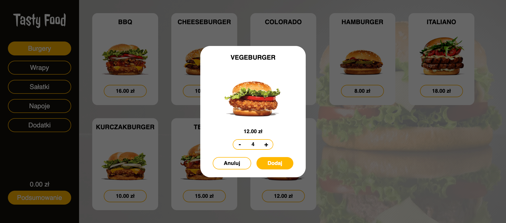
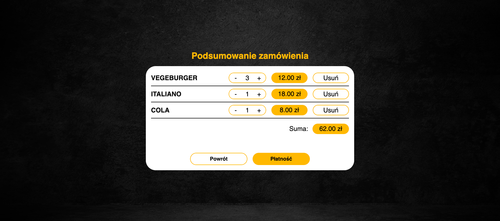

# order-food-panel

Order Food Panel is a school web application that mimics a restaurant ordering system, similar to McDonald's. It was created using HTML, CSS and JavaScript. The app consists of a set of functions that work together to handle the entire ordering process up to the point of payment.

### Technologies used:
- HTML
- CSS
- JavaScript

### Key Features
- Welcome Screen: Displays the initial welcome screen and provides a smooth transition to the ordering process.
- Navigation categories: Allows users to navigate through different dish categories, providing a user-friendly browsing experience.
- Product focus: Provides a focused view of the selected product, including name, image and price.
- Product quantity customization: Allows users to increase or decrease the quantity of the selected product before adding it to the order.
- Order Summary: Generates a summary of the selected products, displaying their names, quantities, prices and total order value.
- Order Modification: Allows users to modify the quantity of products in the order summary, providing flexibility in the ordering process.
- Product Removal: Allows users to remove specific products from the order summary, if desired.
- Finalizing an order: Redirects users to the final view, where the order is confirmed and prepared for payment.
- Multiple order support: Supports the ability to place multiple orders, allowing users to place orders in a single session.

### Desktop page view

